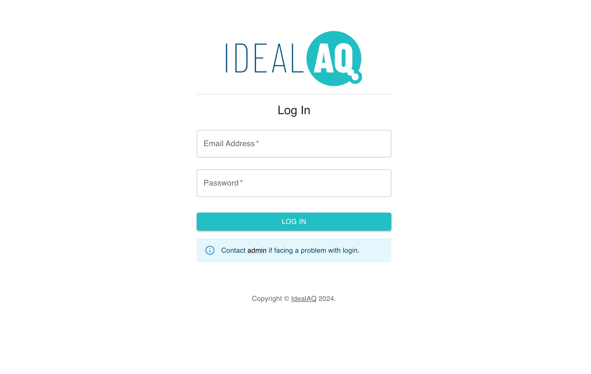
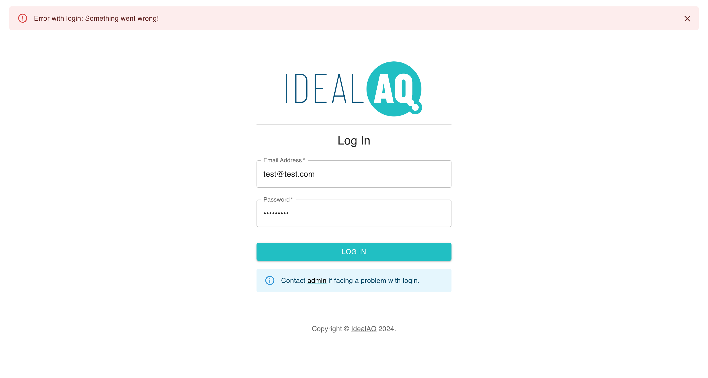
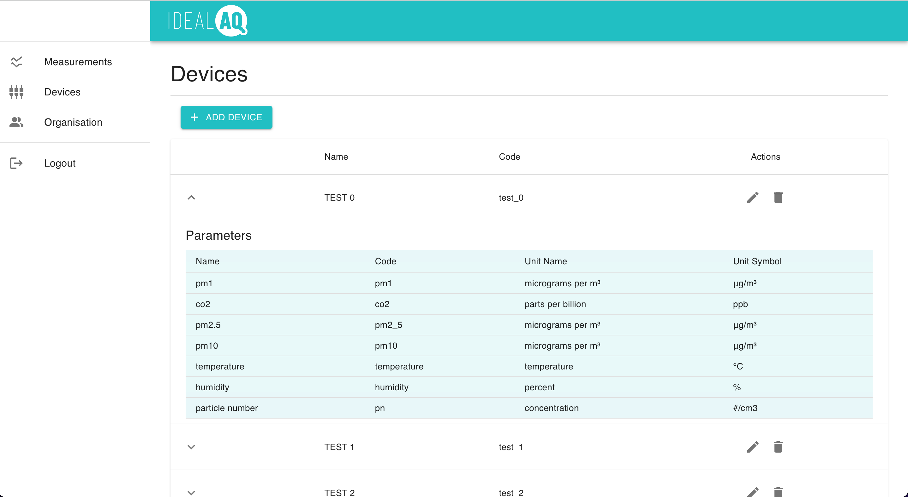
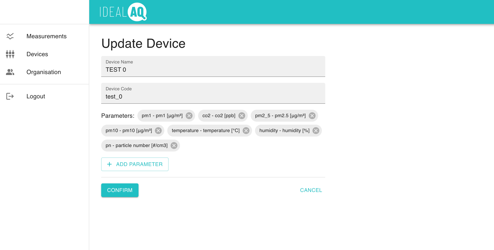
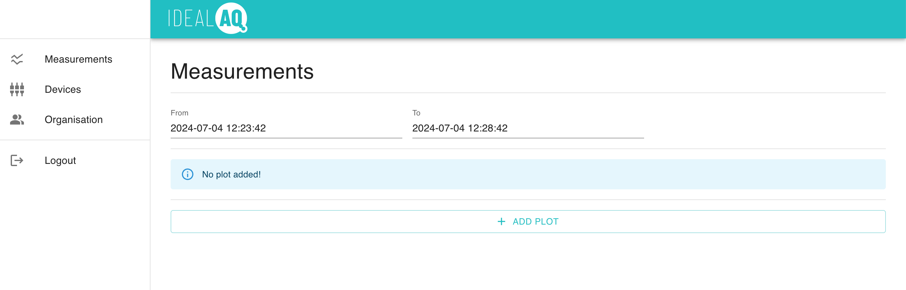
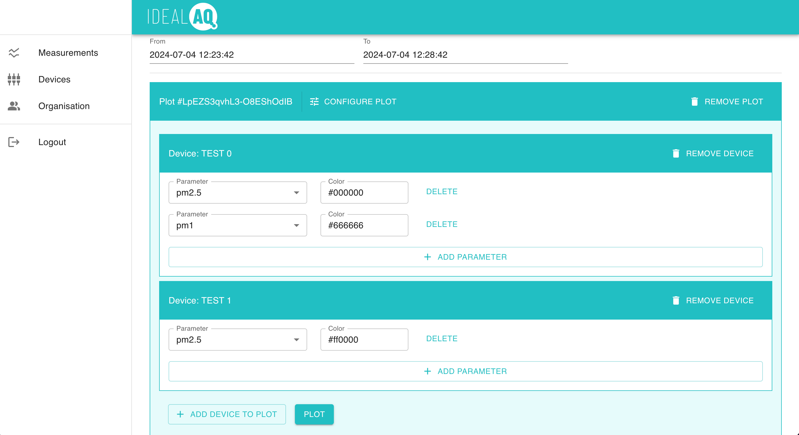
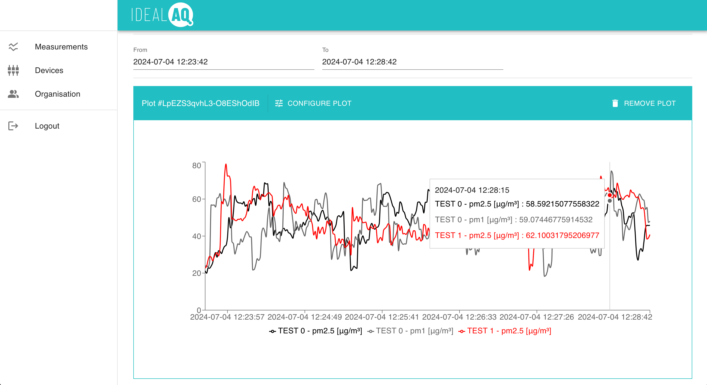
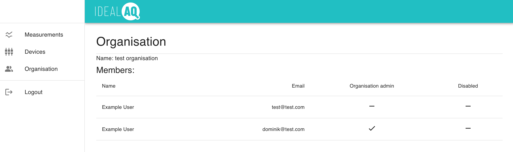

# Backend for IdealAQ sensor data monitoring app
This app was completed as part of [Full-stack open](fullstackopen.com/en/) course. Additionally, the created solution aims to serve as a useful tool for [IdealAQ](https://idealaq.com/) project with a potential to be the base or a case study for future production version of the web app.

The app is used as a frontend for data visualisation app.

The backend app is in its own repository ([AQvis-backend](https://github.com/drohal3/AQvis-backend)).

## Prerequisites
To build or run Docker image you must install Docker. 

## ENV variables
| variable          | description        | note                                                                       |
|-------------------|--------------------|----------------------------------------------------------------------------|
| **backend**       |                    |                                                                            |
| VITE_BACKEND_URL  | URL of the backend | example: `http://127.0.0.1:8080 ` **Note:** effects during the build stage |

## Useful commands
To run the frontend app locally, run the following commands from the project root directory:
```bash
npm install
```
```bash
npm run dev
```
accessed at  http://localhost:5173/ (if differs, the correct url should is printed in terminal)

To build and run Docker image:
```bash
# build - change image name based on your preference
# adjust VITE_BACKEND_URL environmental variable if needed (.env.production)
docker build -t aqvis_frontend_local .
```
```bash
# run image - change port 4000 to your preference
# VITE_BACKEND_URL environmental variable is set when the image is built
docker run -p 4000:5000 aqvis_frontend_local   
```
accessed at http://localhost:4000/

# Instructions to use the app
> **Note:** The provided details such as names or other inputs are valid only for test@test.com user provided for demonstration purposes.

Visit the address of the web app (i.e. http://localhost:5173/ if run locally with `npm run dev`)

## Login
Login requires credentials. The credentials are obtained from admins and given only to trusted people.

- The **username** is usually the email address of the user. 
- The **password** must be kept safe and cannot be shared.



> **Known issue:** Login might fail due to app running with limited resources for demonstration purposes and request timeout. If the error pictured bellow is shown, simply retry the login.




## Device configuration
Before plotting the data, devices must be configured. This is done on the devices page.

Devices are assigned to the organisation and shared among all the members of the organisation.

Adding a device requires setting the device name based on the preference and specifying device code that is strictly assigned to the device.
Additionally, the parameters must be defined.

An example of the list of available parameters and their codes is available in this [documentation](https://idealaq.github.io/cpcvis-data-docs/).



You can add/remove parameters to/from TEST 1, TEST 2, TEST 3 and TEST 4, or delete them and recreate them. They support parameters with the same codes as TEST 0.

Please, **DO NOT modify TEST 0!**



## Data plotting
Data plotting is located under **Measurements** in the menu on the left.

With test@test.com user use only the following time range when plotting data:
- time from: `2024-07-04 12:23:42`
- time to: `2024-07-04 12:28:42`



Define devices and their parameters to plot:


Hit the plot button:


You can add multiple plots by clicking "Add plot" button under the plot.

Edit existing plot by clicking the "configure" button in the top plot bar.

## Organisation
In organisation section, organisation members are listed:



# Future development (pending decisions)
> **Note:** The app is in beta version and has limited functionality. The more features will be added once the requirements are defined.

- plotting real-time data as they flow from sensors
- saving plot configuration
- more...